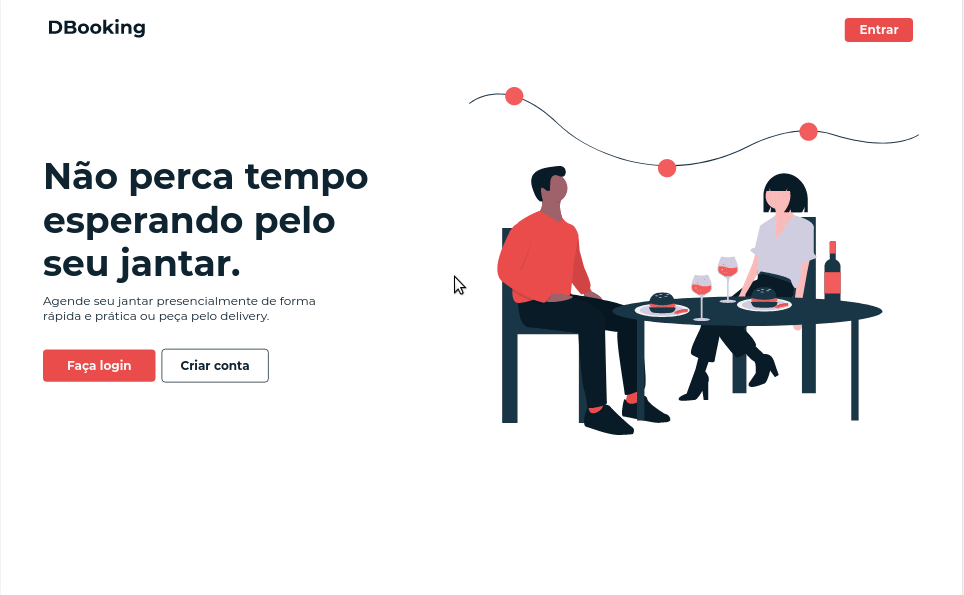

# DBooking - React web app

Uma aplicação que permite o usuário fazer uma reserva presencial para um jantar. A reserva de uma mesa será feita como a reseva de um lugar em aplicativos de cinema, apresentando todos os lugares disponíveis do restaurante e indicando quais estão livres ou não para a data e horário desejados.

Além da opção de reserva, o usuário também pode fazer um pedido através do delivery.

## Demo da aplicação

## Técnologias

Esta aplicação é desenvolvida utilizando React JS e outras técnologias, como:

- Redux
- Styled components
- Axios
